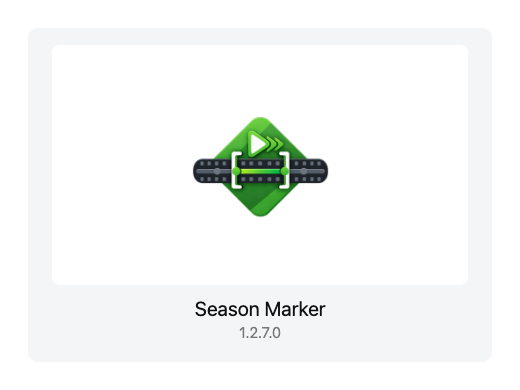
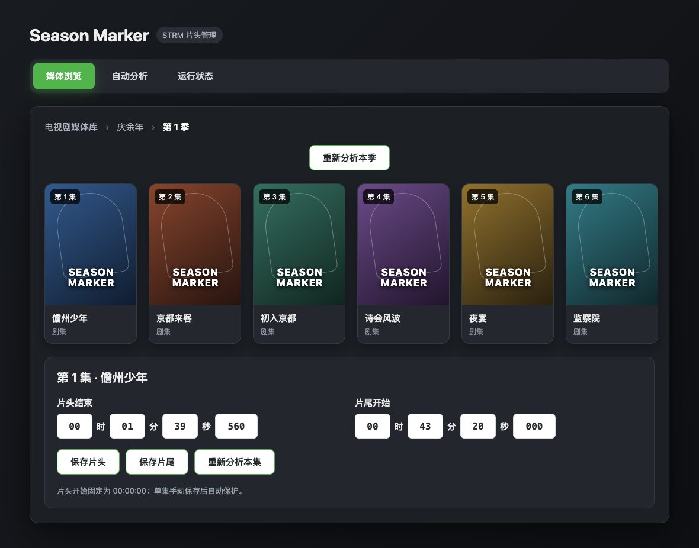

<p align="center"></p>

# Season Marker

Emby 的 STRM 片头与片尾标记插件。片头使用 Emby 原生声纹引擎，片尾通过同季尾部 Chromaprint 声纹寻找重复片段，也可以在管理页手动修改某一集的片头、片尾时间。





> 截图中的剧名和时间为演示数据。

## 支持的功能

- 分析 STRM 剧集片头
- 分析同季重复片尾音频并生成片尾开始标记
- 按媒体库、电视剧、季、集浏览
- 手动修改单集片头结束和片尾开始时间
- 单独重置某一集的片头和片尾，不影响同季其他剧集
- 重置整个季度的片头、片尾及相关覆盖，不影响其他季度
- 分别重新分析本季或单集的片头、片尾，也可同时分析本季片头片尾
- 新增剧集后增量分析
- 从“自动分析”页面立即补充全部已选媒体库的缺失标记
- Emby 计划任务
- 管理页分析日志
- 在运行状态中停止正在执行或等待执行的分析任务

片尾分析默认手动触发，也可以在自动分析设置中启用计划任务和新增剧集片尾分析。

## 安装

1. 下载 [SeasonMarker.dll](https://github.com/xpg8802667/SeasonMarker/releases/latest/download/SeasonMarker.dll)。
2. 复制到 Emby 配置目录：

   ```text
   /config/plugins/SeasonMarker.dll
   ```

3. 重启 Emby。
4. 在“控制台 → 插件”中打开 `Season Marker`。

升级时直接替换 DLL，然后重启 Emby 即可。

## 使用

### 查看和修改标记

进入“媒体浏览”，依次选择媒体库、电视剧、季和剧集。点击单集后，可以查看并修改：

- 片头结束时间
- 片尾开始时间

片头开始固定为 `00:00:00`。单集手动保存后不会被普通自动分析覆盖。
“重置本集片头片尾”会清空当前集的两个标记，并防止普通自动分析立即恢复；仍可使用单集重新分析生成新结果。

### 分析片头与片尾

- 在季度页面分别点击“重新分析本季片头”“重新分析本季片尾”，或使用“同时分析本季片头片尾”；确认后会自动进入运行状态。
- 在单集编辑页面分别点击“重新分析本集片头”或“重新分析本集片尾”。
- 在“自动分析”中开启新增剧集分析，适合仍在更新的连载剧。
- 在“自动分析”底部点击“立即分析全部媒体库”，可保存当前设置并补充所有已选媒体库中的缺失标记。
- 也可以在“控制台 → 计划任务”中手动运行或设置定时任务。
- 分析过程和错误可以在“运行状态 → 分析日志”中查看，自动刷新可随时通过复选框关闭；需要时可点击“停止任务”中断分析。

## 使用前注意

- 目前只测试了 Emby `4.9.5.x` 版本，其他版本请自行测试。
- Emby 原生片头功能需要 Premiere。
- 片尾分析默认读取每集最后 8 分钟，需要同季至少两集；没有可靠重复片尾时不会覆盖原标记。
